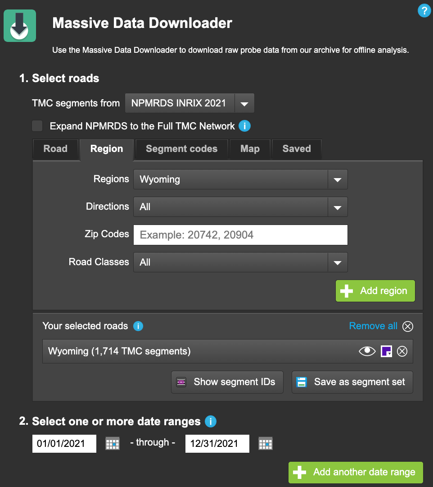
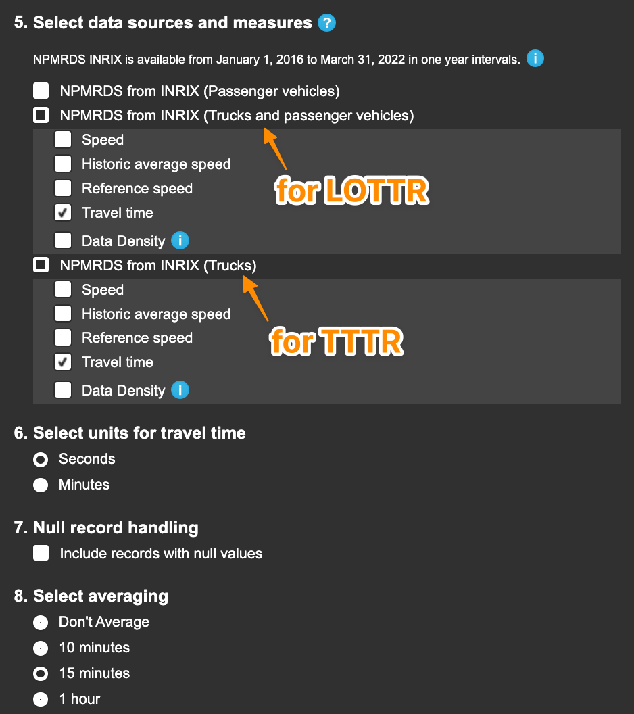

# NPMRDS Processing Tools for Assessing System Performance, Freight Movement, and CMAQ Improvement Program

This repository provides some scripts and tools written in R for effectively working with voluminous NPMRDS data for calculating the FHWA Transportation Performance Management (TPM) PM3 System Reliability, Freight, and CMAQ Congestion Performance  Performance Measures. For use with NPMRDS (2016 – Present) downloaded from https://npmrds.ritis.org/

Use this package to: 

* Calculate TMC-segment Level of Travel Time Reliability (LOTTR) and Truck Travel Time Reliability (TTTR) metric scores
* Calculate Interstate / Non-Interstate NHS Percent of Person Miles Reliable and TTTR Index performance measures
* Calculate Annual Hours of Peak Hour Excessive Delay per Capita performance measure
* Generate an HPMS Submittal File based on the [HPMS Field Manual Supplemental Guidance](https://www.fhwa.dot.gov/tpm/guidance/pm3_hpms.pdf)


## Installation

```r
library(devtools)
devtools::install_github("markegge/fhwa_pm3")
library(pm3)
```

### A Minimal Example

_To run the example below, create a RITIS NPMRDS export using the instructions below or copy `Readings.csv`, `TMC_Identification.csv` and `speed_limits.csv` from `tests/testthat` into your working directory. Note, the example below uses the same readings file is used for both the LOTTR and TTTR metrics. In the real world, the LOTTR metric should use All Vehicles travel time data, and the TTTR metric should use Trucks travel time data._

```R
library(data.table)
library(pm3)

# Calculate segment-level LOTTR and TTTR scores
# Using "All Vehicles" readings file only for demo purposes
lottr_scores <- lottr("Readings.csv", metric = "LOTTR")
tttr_scores <- tttr("Readings.csv", metric = "TTTR")

# Read in TMC attributes from RITIS export
tmcs <- fread("TMC_Identification.csv")

tmcs[, nhs_miles := miles * nhs_pct * 0.01]
tmcs[, vmt := ifelse(faciltype == 1, 1.0, 0.5) * aadt * nhs_miles]
tmcs[, system := ifelse(f_system == 1, "Interstate", "Non-Interstate NHS")]

# Merge the scoress table to the TMCs attribute table
tmcs <- merge(tmcs, lottr_scores, by.x = "tmc", by.y= "tmc_code")
tmcs <- merge(tmcs, tttr_scores, by.x = "tmc", by.y= "tmc_code", all.x = TRUE)

# Calculate LOTTR scores
tmcs[!is.na(vmt), .(pct_reliable = sum(vmt * reliable) / sum(vmt)), by = system]
#>                system pct_reliable
#> 1: Non-Interstate NHS    0.7545984
#> 2:         Interstate    1.0000000

# Calculate TTTR score
tmcs[f_system == 1, .(tttr_index = sum(max_tttr * nhs_miles) / sum(nhs_miles))]
#>    tttr_index
#> 1:       1.08

# Calculating Peak Hour Excess Delay
phed_scores <- phed(travel_time_readings = "Readings.csv",
                    tmc_identification = "TMC_Identification.csv",
                    speed_limits = fread("speed_limits.csv"),
                    urban_code = 56139,
                    population = 52898)
#> Peak Hour Excess Delay per Capita for 2020: 0.13 hours

# Generate an HPMS Submittal File
# Requires verbose = TRUE for LOTTR and TTTR scores
hpms("TMC_Identification.csv",
     lottr("Readings.csv", verbose = TRUE), 
     tttr("Readings.csv", verbose = TRUE), 
     phed_scores)
#> Writing output to hpms_2021.txt
```

## Calculating LOTTR and TTTR Metric Scores

To calculate LOTTR or TTTR Metric scores:

1. Log in to RITIS [https://npmrds.ritis.org/analytics/](https://npmrds.ritis.org/analytics/)
2. Go to Massive Data Downloader
3. Choose the appropriate "TMC segments from" value (e.g. "NPMRDS INRIX 2019")
4. Choose your region (e.g. Wyoming) click Add
5. Specify appropriate date range, e.g 01/01/2019 – 12/31/2019

6. Select data sources and measures: 
    * "NPMRDS form INRIX (Trucks and Passenger Vehicles): Travel Time" for LOTTR Measure (the other fields are optional)
    * "NPMRDS from Inrix (Trucks): Travel Time" for TTTR Measure
9. Set averaging to 15 minutes (per PM3 Final Rule) and Submit

10. Download and extract the resulting dataset
11. Calculate scores using `lottr` and `tttr`. Monthly scores may be calculated using `monthly = TRUE` 

## Calculating PHED Scores

The package `phed()` function implements the calculation procedures in FHWA's guidance:
[National Performance Measures for Congestion, Reliability, and Freight, and CMAQ Traffic Congestion (CMAQ PHED Calculation Procedures)](https://www.fhwa.dot.gov/tpm/guidance/hif18040.pdf)

At a minimum, the `phed()` function requires speed limits for all TMC segments. The speed limits should be provided in a data.frame-like object in the following format:

|tmc|speed_limit|
|---|-----------|
|000+10001|65|
|000-10002|65|
|000+10003|55|

Additionally, an urbanized area code must by provided to filter the travel time observations to only the TMC segments within the matching urban area. (The easiest way to determine the urban area is to open the TMC shapefile and select a segment within the urban area to look up the urban_area field value.)

### Traffic Volume Factors

Additionally, traffic volume factors and profiles are used to traslate AADT values (included in the NPMRDS `TMC_Identification.csv` file from HPMS) to hourly estimated "persons". Default profiles have been built into the function, but users are encouraged to use profiles that are specific the urbanized area. Factors must be provided for both freeway and non_freeway facilities (though these may be the same).

Factors must be provided in the format below:

#### Month of Year Factors

Factors should correspond the mutliplicative factor to make an AADT value specific to the month.

|month|freeway|non_freeway|
|-----|-------|-----------|
|1|0.95|0.96|
|2|0.9|0.92|
|...|...|...|
|12|1.01|0.99|

#### Day of Week Factors

Day of week factors must be provided for weekdays using integer values for weekdays for a 7-day week beginning on Sundays (e.g. Monday = 2, Tuesday = 3, Wednesday = 4, Thursday = 5, Friday = 6).

|day|freeway|non_freeway|
|-----|-------|-----------|
|2|1.05|1.05|
|3|1.05|1.05|
|...|...|...|
|6|1.10|1.10|

#### Hourly Volume Distribution Profile

The hourly volume profile must be provided for peak hours integer values for hours of the day (e.g. 6:00 am = 6). Note, values for freeway and non_freeway should correspond to the percent of daily traffic occuring during the hour. The profile may be provided for all 24 hours, or for selected peak hours only.

|hour|freeway|non_freeway|
|-----|-------|-----------|
|6|0.05|0.05|
|7|0.08|0.075|
|...|...|...|
|19|0.08|0.07|

### Occupancy Factors

Finally, average vehicle occupancy (AVO) factors are provided (AVO Cars = 1.7, AVO Trucks = 1, AVO Buses = 10.7) based on FHWA guidance. Using AVO factors that are specific to your urban area are recommended. These may be obtained using the methods described in: [Average Vehicle Occupancy Factors for Computing Travel Time Reliability Measures and Total Peak Hour Excessive Delay Metrics (April 2018)](https://www.fhwa.dot.gov/tpm/guidance/avo_factors.pdf)

Usage:

```R
phed(
  travel_time_readings,
  tmc_identification,
  speed_limits,
  urban_code,
  pm_peak = 3,
  avo_cars = 1.7,
  avo_trucks = 1,
  avo_buses = 10.7,
  moy_factor = moy_factor_default,
  dow_factor = dow_factor_default,
  hod_profile = hod_profile_default,
  population = NA
)
```

If the population argument is provided, the function will output the calculated PHED per capita measure. The function returns a data.table with PHED per TMC.

## Creating an HPMS Submittal File

The `hpms()` function outputs a .txt file in the appropriate format for HPMS submission. See the (HPMS Supplemental Guidance for PM3)[https://www.fhwa.dot.gov/tpm/guidance/pm3_hpms.pdf]

If the optional PHED scores are not provided (not required for all states), the PHED value is set to 0 (in accordance with FHWA guidance).

The input `lottr` and `tttr` scores *must* be generated with verbose = TRUE.

The output is generated for the year corresponding to the TMCs in the TMC Identification file.


```R
# Calculating Peak Hour Excess Delay
speed_limits <- speed_limits = fread("speed_limits.csv")
phed_scores <- phed("data/all_vehicles/Readings.csv",
                    "TMC_Identification.csv",
                    speed_limits,
                    urban_code = 56139)

# Generate an HPMS Submittal File
hpms("TMC_Identification.csv",
     lottr("data/all_vehicles/Readings.csv", verbose = TRUE),
     tttr("data/trucks/Readings.csv", verbose = TRUE),
     phed_scores)
```


## PM3 Guidance

The PM3 Performance measures are best described in [FHWA's June 1, 2017 PM3 Webinar Presentation](https://www.fhwa.dot.gov/tpm/rule/170601pm3.pdf)

FWHA has also provided two sets of guidance on calculating the LOTTR and TTTR performance metrics:

* [General Guidance and Step-by-Step Metric Calculation Procedures for National Performance Measures for Congestion, Reliability, and Freight, and CMAQ Traffic Congestion](https://www.fhwa.dot.gov/tpm/guidance/hif18040.pdf) 
* [FHWA Computation Procedure for Travel Time Based and Percent Non-Single Occupancy Vehicle (non-SOV) Travel Performance Measures](https://www.fhwa.dot.gov/tpm/guidance/hif18024.pdf)

You can also reference the definitive [Federal Register PM3 Final Rule](https://www.federalregister.gov/documents/2018/05/31/2018-11652/national-performance-management-measures-assessing-performance-of-the-national-highway-system).

## TMC Network and Traffic Volumes

Each year the TMC network is updated. This reflects improvements in TTI's conflation methodolgies, corrections submitted by users, as well as changes in the underlying attribute data.

The NPMRDS TMC network is a set of INRIX/HERE TMC segments to which selected HPMS attribtues have been conflated. There is a *two year lag* between the TMC network and the HPMS data. For example, the 2019 NPMRDS TMC network reflects AADT values based on 2017 HPMS. Since FHWA only requires traffic counts once every three years, some AADT values reported in the 2019 NPRMDS TMC network may be based on 2014 traffic counts. The NPMRDS reported AADT values should be calculating PM3 Performance Measures, but for other analysis it is better to use more recent sources of traffic counts. 

For a method for estimating order-of-magnitude traffic volumes using NPMRDS data itself, see [this repository](https://bitbucket.org/high-street/npmrds_probe_counts/).

## Attribution

Package author: Mark Egge, High Street (egge@highstreetconsulting.com)

License: Mozilla Public License Version 2.0

## What's New

* June 15, 2022: Refactored function calls to provide greater consistency between measures. LOTTR and TTTR are now scored using `lottr()` and `tttr()` respectively, rather than `score()`. HPMS function now accepts PHED scores.
* June 10, 2022: Added PHED function to calculate PHED given a travel time readings file and speed limits